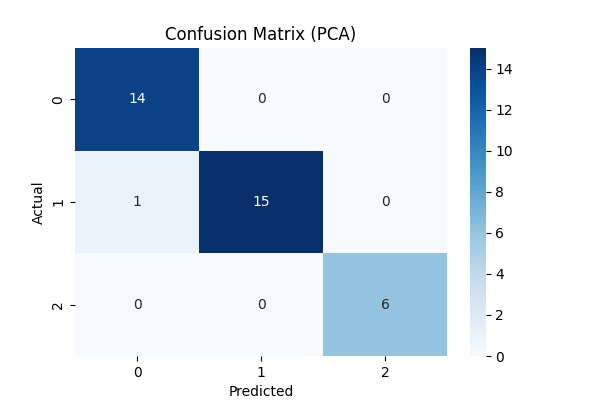
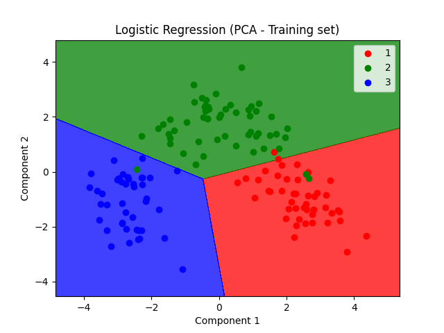
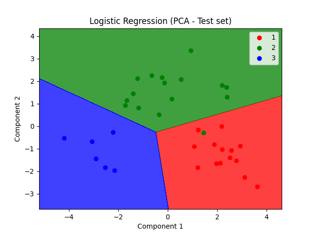
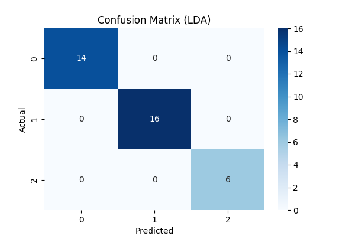
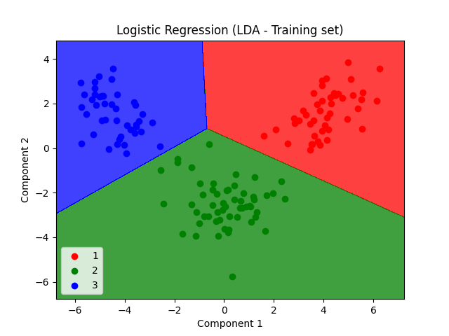
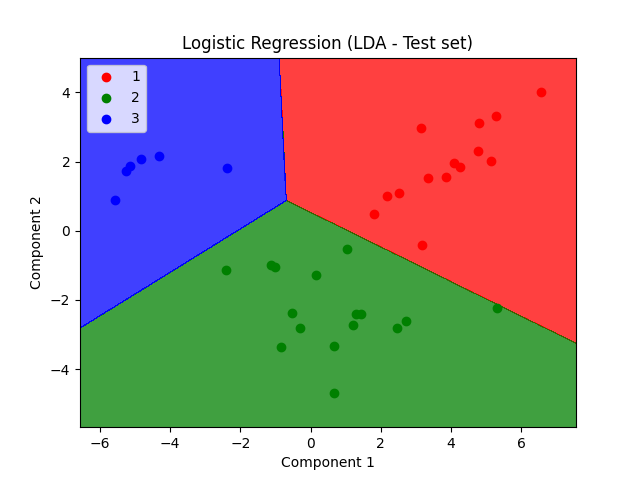

# Dimensionality Reduction Techniques Comparison on Wine Dataset

## Introduction

This project aims to compare three dimensionality reduction techniques—**Principal Component Analysis (PCA)**, **Linear Discriminant Analysis (LDA)**, and **Kernel PCA**—applied to the Wine dataset. The goal is to reduce the dataset's dimensionality and evaluate each technique's performance using Logistic Regression as the classifier.

## Dataset

The Wine dataset consists of 178 instances with 13 chemical analysis features of wines grown in the same region in Italy but derived from three different cultivars (customer segments).

### Features:

1. **Alcohol**
2. **Malic Acid**
3. **Ash**
4. **Alcalinity of Ash**
5. **Magnesium**
6. **Total Phenols**
7. **Flavanoids**
8. **Nonflavanoid Phenols**
9. **Proanthocyanins**
10. **Color Intensity**
11. **Hue**
12. **OD280/OD315 of Diluted Wines**
13. **Proline**

### Target Variable:

- **Customer Segment** (1, 2, or 3)

## Project Structure

- **Data Preprocessing**
  - Loading the dataset.
  - Splitting into training and test sets.
  - Feature scaling.
- **Dimensionality Reduction**
  - Applying PCA.
  - Applying LDA.
  - Applying Kernel PCA.
- **Classification**
  - Training Logistic Regression models.
- **Evaluation**
  - Confusion matrices.
  - Accuracy scores.
- **Visualization**
  - Decision boundary plots.
  - Confusion matrix heatmaps.

## Implementation Details

### Data Preprocessing

- **Train/Test Split**: The dataset is split into 80% training and 20% testing data.
- **Feature Scaling**: `StandardScaler` is used to normalize features to have zero mean and unit variance.

### Dimensionality Reduction Techniques

#### Principal Component Analysis (PCA)

- **Concept**: Unsupervised technique that transforms the original variables into a new set of uncorrelated variables (principal components) that explain most of the variance in the data.
- **Implementation**: Applied `PCA(n_components=2)` to reduce the dataset to two principal components.

#### Linear Discriminant Analysis (LDA)

- **Concept**: Supervised technique that finds the linear combinations of features that best separate the classes.
- **Implementation**: Applied `LDA(n_components=2)` to project the data onto a lower-dimensional space maximizing class separability.

#### Kernel PCA

- **Concept**: Non-linear form of PCA that uses kernel methods to project data into a higher-dimensional space where it becomes linearly separable.
- **Implementation**: Applied `KernelPCA(n_components=2, kernel='rbf')` for non-linear dimensionality reduction.

### Classification

- **Algorithm**: Logistic Regression is used to classify the wines based on the reduced features.
- **Training**: The classifier is trained separately on the output of each dimensionality reduction technique.

## Results and Analysis

### 1. Principal Component Analysis (PCA)

**Accuracy**: **97.22%**

#### Confusion Matrix

- The confusion matrix shows that one instance in the test set is misclassified.

#### Training Set Decision Boundary

#### Test Set Decision Boundary

- The decision boundaries separate the classes well but with a misclassification due to overlapping in the projected space.

### 2. Linear Discriminant Analysis (LDA)

**Accuracy**: **100.00%**

#### Confusion Matrix

- All test instances are correctly classified using LDA.

#### Training Set Decision Boundary

#### Test Set Decision Boundary

- The classes are well-separated, and the model generalizes perfectly to the test data.

### 3. Kernel PCA

**Accuracy**: **100.00%**

#### Confusion Matrix

- Similar to LDA, Kernel PCA makes no misclassifications.

#### Training Set Decision Boundary

#### Test Set Decision Boundary

- Kernel PCA captures non-linear patterns, resulting in perfect classification with complex decision boundaries.

## Conclusion

- **LDA** and **Kernel PCA** both achieved **100% accuracy**, demonstrating their effectiveness in dimensionality reduction while preserving class separability.

- **LDA**, being a supervised linear technique, leverages class labels to maximize separability between classes, resulting in perfect classification with simpler linear decision boundaries.

- **Kernel PCA**, a non-linear technique, effectively captures non-linear patterns in the data, leading to perfect classification as well. However, it introduces more complex decision boundaries.

- **PCA** achieved **97.22% accuracy**, with one misclassification. As an unsupervised linear technique, PCA may not capture class separability as effectively as LDA or Kernel PCA due to the lack of label information during dimensionality reduction.

- **Recommendation**: For datasets similar to the Wine dataset, where classes are well-separated and the relationships are largely linear, **LDA** is preferred due to its simplicity, efficiency, and excellent performance. **Kernel PCA** can also be effective, especially if non-linear relationships are present, but may introduce unnecessary complexity if linear methods suffice.

## Visual Summary

- **PCA**: Provides linear decision boundaries but may result in some misclassifications due to not accounting for class labels during dimensionality reduction.

- **LDA**: Offers clear, linear decision boundaries with perfect classification, leveraging class labels to maximize class separability.

- **Kernel PCA**: Captures complex, non-linear patterns, resulting in perfect classification, but may introduce complexity without significant performance gains over LDA in this context.

## References

1. Machine Learning A-Z: AI, Python & R [2024]  
Created by Hadelin de Ponteves, Kirill Eremenko, SuperDataScience Team, and the Ligency Team  
[https://www.udemy.com/course/machinelearning/](https://www.udemy.com/course/machinelearning/)

